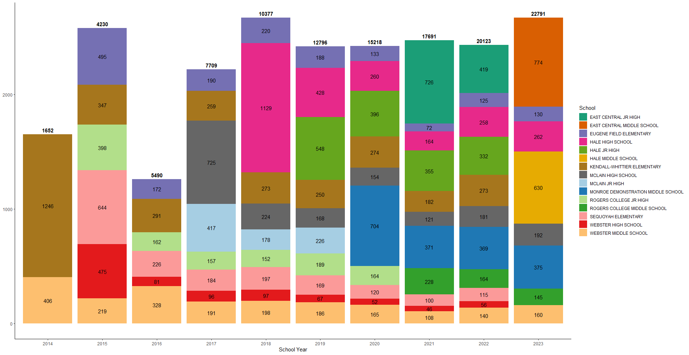

```{r setup, include=FALSE}
knitr::opts_chunk$set(echo = TRUE)
```

<a href="MAP_Analysis.html" style="font-size: 16px;">MAP Analysis</a>


<a href="Course-Grades-Analysis.html" style="font-size: 16px;">Course Grades Analysis</a>


<a href="DESSA-Analysis.html" style="font-size: 16px;">DESSA Analysis</a>


<a href="ADA_Analysis.html" style="font-size: 16px;">ADA Analysis</a>


<a href="FL-Longitudinal.html" style="font-size: 16px;">Longitudinal Analysis</a>

## Cumulative Student Population Served from FY14-FY23


